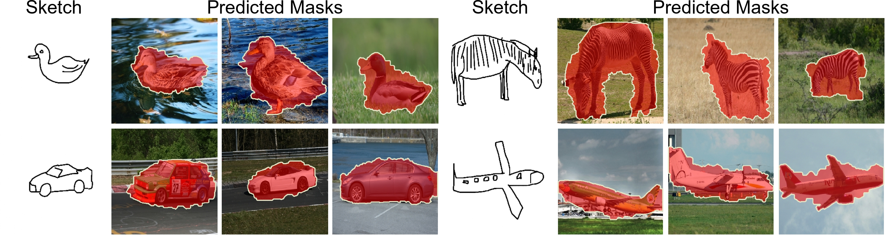

# SketchFusion: Learning Universal Sketch Features through Fusing Foundation Models
### Official repository of ``SketchFusion: Learning Universal Sketch Features through Fusing Foundation Models``
## **CVPR 2025**
[](https://arxiv.org/pdf/2503.14129)
[]()
[](https://subhadeepkoley.github.io/SketchFusion/)

## Abstract

<p align="center">

</p>
 
While foundation models have revolutionised computer vision, their effectiveness for sketch understanding remains limited by the unique challenges of abstract, sparse visual inputs. Through systematic analysis, we uncover two fundamental limitations: Stable Diffusion (SD) struggles to extract meaningful features from abstract sketches (unlike its success with photos), and exhibits a pronounced frequency-domain bias that suppresses essential low-frequency components needed for sketch understanding. Rather than costly retraining, we address these limitations by strategically combining SD with CLIP, whose strong semantic understanding naturally compensates for SD's spatial-frequency biases. By dynamically injecting CLIP features into SD's denoising process and adaptively aggregating features across semantic levels, our method achieves state-of-the-art performance in sketch retrieval (+3.35\%), recognition (+1.06\%), segmentation (+29.42\%), and correspondence learning (+21.22\%), demonstrating the first truly universal sketch feature representation in the era of foundation models.

## Architecture
<p align="center">

</p>

## Datasets
- For Category-level ZS-SBIR:
  - [Sketchy](https://dl.acm.org/doi/10.1145/2897824.2925954)
  - [TUBerlin](https://cybertron.cg.tu-berlin.de/eitz/projects/classifysketch/sketches_png.zip)
  - [QuickDraw](https://github.com/googlecreativelab/quickdraw-dataset)
- For ZS-FG-SBIR:
  - [Sketchy](https://dl.acm.org/doi/10.1145/2897824.2925954)
- For Sketch-Recognition:
  - [TUBerlin](https://cybertron.cg.tu-berlin.de/eitz/projects/classifysketch/sketches_png.zip)
  - [QuickDraw](https://github.com/googlecreativelab/quickdraw-dataset)
- For Sketch-Photo Correspondence
  - [PSC6K](https://github.com/cogtoolslab/photo-sketch-correspondence/blob/main/PSC6K_Benchmark_README.md)
- For Sketch-Based Image Segmentation:
  - [Sketchy](https://dl.acm.org/doi/10.1145/2897824.2925954)


## How to run the code?
The `src` folder holds the source files. An example command to run the code is given below:

After downloading the .zip file into `./sketchfusion/`, run the following,
```shell
$ bash setup.sh
$ python ./sketchfusion/src/SD_CLIP/pck_train_combined.py --config ./sketchfusion/src/SD_CLIP/configs/train_sketch.yaml
```


## Qualitative Results
<p align="center">

</p>
<br>
Qualitative results of Sketch-Photo Correspondence. 
<span style="color:green">Green</span> circles and squares depict source and
GT points respectively, while <span style="color:red">Red</span> squares denote predicted points

<br>
<br>
 
<p align="center">

</p>
<br>
Qualitative results for sketch-based image segmentation.
Given a query sketch, our method generates separate segmentation
masks for all images of that category. 


## Quantitative Results

Quantitative results of our method against a few SOTAs.
<br>
<p align="center">

</p>
<br>
<br>
<p align="center">

</p>
<br>
<br>
<p align="center">

</p>
<br>
<br>
<p align="center">

</p>
<br>


## Credits

This repository is built on top of [CLIP](https://github.com/openai/CLIP.git), [DIFT](https://github.com/Tsingularity/dift), and [Geo-Aware](https://github.com/Junyi42/GeoAware-SC.git).
Thanks to the authors.

## Bibtex

Please cite our work if you found it helpful. Thanks.
```
@inproceedings{koley2025sketchfusion,
  title={{SketchFusion: Learning Universal Sketch Features through Fusing Foundation Models}},
  author={Subhadeep Koley and Tapas Kumar Dutta and Aneeshan Sain and Pinaki Nath Chowdhury and Ayan Kumar Bhunia and Yi-Zhe Song},
  booktitle={CVPR},
  year={2025}
}
```
